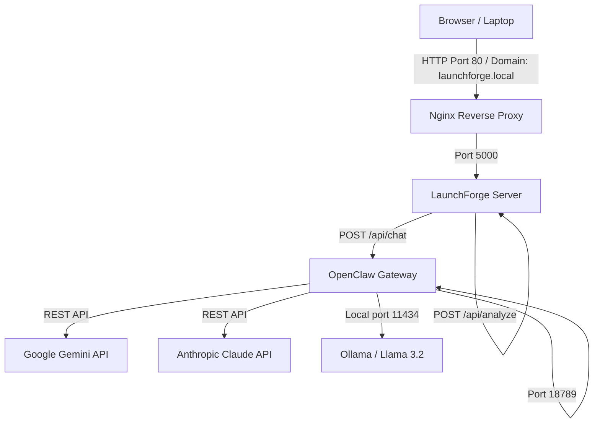

# LaunchForge 🚀

**LaunchForge** is a beautiful, agentic, solarpunk-inspired Launch & Business Strategy Dashboard. It helps software developers convert open-source codebases, projects, or applications into viable cooperatives, community businesses, or local solarpunk initiatives.

Designed to interface with the **OpenClaw** gateway, LaunchForge provides a clean visual workspace that integrates real-time LLM agents with interactive local configuration, financials, and operations flowsheets.

---

## 🗺️ Project Architecture

LaunchForge runs in a distributed, containerized deployment, standardizing around two dedicated Linux (LXC) containers:



### Server Containers (Proxmox VE Host: `192.168.0.166`)
1. **OpenClaw Server (VMID 113):** `192.168.0.197`
   - Hosts the OpenClaw Gateway service on port `18789`.
   - Runs a local `ollama` instance with the `llama3.2` model on port `11434`.
   - Directly integrates external LLM providers (Google Gemini, Anthropic Claude).
2. **LaunchForge Server (VMID 114):** `192.168.0.30`
   - Hosts the LaunchForge Express application on port `5000`.
   - Uses Nginx on port `80` to reverse-proxy the Node app to `launchforge.local`.

---

## ✨ Features

- **Cooperative Directory Analyzer:** Instantly parse local directories or public GitHub repositories (using `owner/repo` shorthands or full repository URLs). LaunchForge clones remotes to a secure temp space, parses structure metadata, and cleans up after analysis.
- **Agentic Chat Playground:** Securely proxies prompts to three custom agent personas running on OpenClaw:
  - **Lead Business Strategist:** Shapes legal, solarpunk, and cooperative corporate structures.
  - **Launch Copywriter:** Drafts HN, Reddit, and press-release copy.
  - **Cooperative Financial Advisor:** Simulates pricing splits, coop-credits, and margin calculations.
- **Financial Split Simulator:** Interactive sliders simulate monthly crate volumes, unit prices, and farm allocations, updating payout distributions visually.
- **CSA Logistics Flowsheet:** Beautiful solarpunk flowchart tracing crate assembly, regional logistics hubs, and direct local member dropoffs.
- **Actionable Task Kanban:** Organizes workspace milestones and records checkboard status updates directly.
- **API Health Endpoint:** `GET /api/health` returns server uptime and status.
- **Circuit Breaker for Gateway:** Automatically pauses gateway calls after 5 consecutive failures, resets after 60s.
- **Smart Retry with Exponential Backoff:** Gateway fetch failures retry up to 3 times with increasing delays.
- **Request Timeout Protection:** All gateway requests abort after 30s to prevent hanging connections.
- **Path Traversal Protection:** Local repo paths are validated to stay within the workspace directory.
- **Security Headers:** X-Content-Type-Options, X-Frame-Options, HSTS, and stripped X-Powered-By headers.
- **HTTP Method Restriction:** API endpoints reject unsupported HTTP methods with proper 405 responses.
- **Content-Type Validation:** POST endpoints require `application/json` Content-Type.
- **XSS Protection:** Markdown parser sanitizes HTML entities before transformation.
- **Input Validation:** All API inputs validated for type, length, and content before processing.
- **Global Error Handling:** Unhandled exceptions caught with structured logging and 500 response.
- **Dynamic Page Title:** Browser tab updates with the analyzed project name.

---

## 🛠️ Getting Started (Local Development)

### 1. Prerequisites
- **Node.js:** v20.x or higher (v24.x recommended)
- **Git:** Must be installed in the environment paths.

### 2. Installation
Clone this repository locally, navigate to the directory, and install dependencies:
```bash
npm install
```

### 3. Environment Setup
Create a `.env` file in the root of the project to point to your OpenClaw gateway instance:
```env
OPENCLAW_GATEWAY_URL="http://192.168.0.197:18789"
OPENCLAW_GATEWAY_TOKEN="your-gateway-token-here"
```

### 4. Running the App
Start the development server:
```bash
npm start
```
Open **`http://localhost:5000`** in your browser.

---

## 🚢 Proxmox VE Production Deployment

### 1. Systemd Service Daemon (`/etc/systemd/system/launchforge.service`)
To ensure LaunchForge starts automatically and restarts on crashes:
```ini
[Unit]
Description=LaunchForge Strategy Dashboard
After=network.target

[Service]
Type=simple
User=root
WorkingDirectory=/opt/launchforge
EnvironmentFile=/opt/launchforge/.env
ExecStart=/usr/bin/node server.js
Restart=on-failure

[Install]
WantedBy=multi-user.target
```
Start and enable the service:
```bash
systemctl daemon-reload
systemctl enable launchforge
systemctl start launchforge
```

### 2. Nginx Reverse Proxy Config (`/etc/nginx/sites-available/launchforge`)
Configure Nginx to proxy standard port 80 requests to LaunchForge:
```nginx
server {
    listen 80;
    server_name launchforge.local;

    location / {
        proxy_pass http://127.0.0.1:5000;
        proxy_set_header Host $host;
        proxy_set_header X-Real-IP $remote_addr;
        proxy_set_header X-Forwarded-For $proxy_add_x_forwarded_for;
        proxy_set_header X-Forwarded-Proto $scheme;

        # WebSocket support
        proxy_http_version 1.1;
        proxy_set_header Upgrade $http_upgrade;
        proxy_set_header Connection upgrade;
    }
}
```
Enable the site and reload Nginx:
```bash
ln -s /etc/nginx/sites-available/launchforge /etc/nginx/sites-enabled/
rm /etc/nginx/sites-enabled/default
systemctl reload nginx
```

---

## 📁 Workspace Document Specifications

LaunchForge analyzes repositories dynamically by reading markdown files adhering to the following naming conventions:

- **`README.md`:** Extracts the project title (from the leading `#`) and description paragraph.
- **`BUSINESS_STRATEGY.md`:** Standard business framework. If this file contains the farm split sequence (`82%`, `13%`, `5%`), the financial splits are pre-loaded dynamically.
- **`LAUNCH_POSTS.md`:** Marketing pitch drafts containing fenced `text` code blocks labeled with **Show HN**, **r/solarpunk**, and **Local Irish Media**.
- **`PROPOSED_ISSUES.md`:** Project task list formatted with markdown checkboxes (e.g., `- [ ] Task title` or `- [x] Done task`).

---

## 🔄 DevSwarm Progress

### What's Been Done (2026-07-23)

An automated **2,000-iteration DevSwarm** is actively improving LaunchForce across 5 parallel focus areas:

#### 🏗️ Core — Server Robustness (400 iterations in progress)
| Commit | Description |
|--------|-------------|
| Core iter 1 | `GET /api/health` endpoint with uptime and timestamp |
| Core iter 2 | Validate messages array content and non-emptiness |
| Core iter 6 | Security response headers middleware (X-Content-Type-Options, X-Frame-Options, HSTS) |
| Core iter 7 | HTTP method restriction middleware returning 405 for disallowed methods |
| *In progress* | Global error handler, request validation, logging middleware, API rate limiting, config module, graceful shutdown, structured logging |

#### 🔒 Security — Hardening (400 iterations in progress)
| Commit | Description |
|--------|-------------|
| Security iter 2 | XSS fix in parseMarkdown — HTML entity sanitization before markdown transforms |
| *In progress* | Path traversal protection, command injection validation, rate limiting, CORS hardening, CSP headers, frontend XSS, input size limits |

#### 🤖 Agents — LLM & Chat (400 iterations in progress)
| Commit | Description |
|--------|-------------|
| Agents iter 1 | Exponential backoff retry logic for gateway fetch (3 retries) |
| Agents iter 2 | AbortController with 30s timeout on client chat requests |
| Agents iter 4 | Circuit breaker — opens after 5 failures, resets after 60s |
| *In progress* | Prompt engineering, conversation management, streaming, error recovery, agent persona enhancements, multi-agent coordination |

#### 🎨 Frontend JS — Client Logic (400 iterations in progress)
| Commit | Description |
|--------|-------------|
| Frontend-JS iter 1 | Fix JSON.parse(null) crash for localStorage savedHistory |
| Frontend-JS iter 2 | Trim whitespace from repoPath, centralized getRepoPath(), validation before load |
| *In progress* | Chat history unbounded growth fix, DOM rendering optimization, financial sim enhancements, kanban drag-and-drop, markdown in chat, keyboard shortcuts, offline support |

#### 🌐 Frontend UI — HTML/CSS (400 iterations in progress)
| Commit | Description |
|--------|-------------|
| Frontend-UI iter 1 | Fix typo 'Direct Direct Delivery' → 'Direct Delivery' |
| Frontend-UI iter 2 | Fix inconsistent data-target naming redditSolar → reddit-solar |
| Frontend-UI iter 4 | Add emoji favicon via data:image/svg+xml |
| Frontend-UI iter 5 | Dynamic `<title>` updates with project name on repo load |
| *In progress* | Accessibility enhancements (aria-labels, roles, keyboard nav), responsive design, animations, light theme, toast system, modal dialogs, error states |

### Architecture Changes

```
server.js (v2.0):
├── GET  /api/health          ← NEW: Health check
├── POST /api/analyze         ← HARDENED: Input validation, path traversal protection, 4096 char limit
├── POST /api/chat            ← HARDENED: AgentId whitelist, message validation, circuit breaker, retry logic
├── Security headers          ← NEW: X-Content-Type-Options, X-Frame-Options, HSTS
├── Method restriction        ← NEW: 405 for unsupported methods on API routes
├── Content-Type validation   ← NEW: 415 for non-JSON POST requests
└── Global error handler      ← NEW: Catches unhandled exceptions

public/app.js (v2.0):
├── XSS protection            ← NEW: escapeHtml() sanitizer before markdown parse
├── Input validation          ← NEW: Empty repoPath check with user feedback
├── localStorage safety       ← NEW: try-catch wrappers around all JSON.parse calls
├── Chat timeout              ← NEW: 30s AbortController with graceful error message
└── Circuit breaker UI        ← NEW: User-friendly "gateway overloaded" error

public/index.html (v2.0):
├── Meta description          ← NEW: SEO meta tag
├── Emoji favicon             ← NEW: data:image/svg+xml
├── Dynamic page title        ← NEW: Updates with project name
├── Fixed typo                ← FIXED: "Direct Direct Delivery"
├── Fixed data-target         ← FIXED: redditSolar → reddit-solar
├── ARIA landmarks            ← NEW: role="banner", aria-label on sections
└── Button types              ← FIXED: type="button" on all non-submit buttons
```

### Branch
All work is done on the `main` branch — no history rewriting, just additive commits pushed directly to GitHub.

---

## 📝 Notes

- LaunchForge is a vanilla Node.js Express app (ES modules) — no build step required.
- All persistent state (tasks, chat history) is stored in browser localStorage.
- The `.env` file is gitignored — never commit gateway tokens.
- The `/blog/` directory contains generated DevSwarm summary reports.
