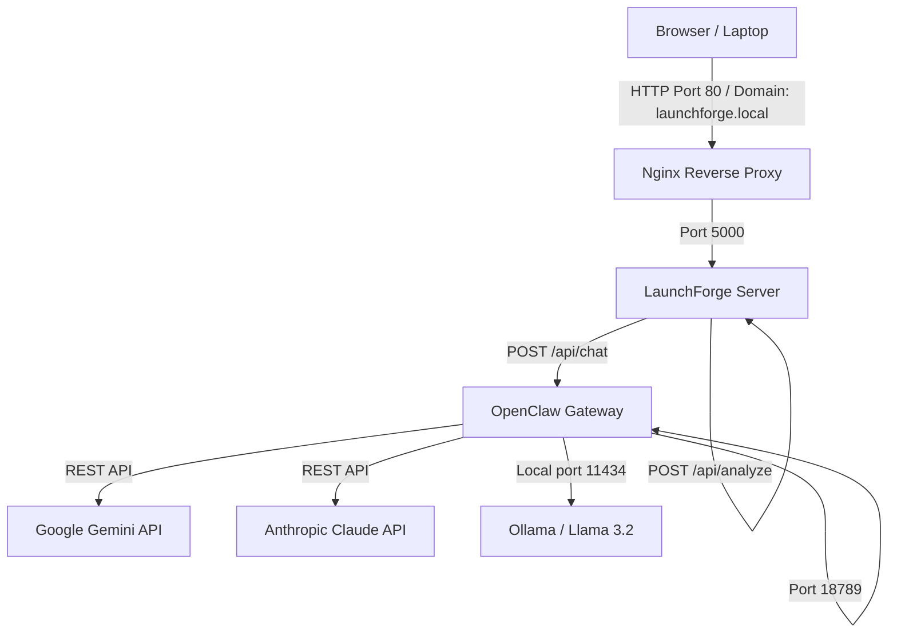

# LaunchForge 🚀

**LaunchForge** is a beautiful, agentic, solarpunk-inspired Launch & Business Strategy Dashboard. It helps software developers convert open-source codebases, projects, or applications into viable cooperatives, community businesses, or local solarpunk initiatives.

Designed to interface with the **OpenClaw** gateway, LaunchForge provides a clean visual workspace that integrates real-time LLM agents with interactive local configuration, financials, and operations flowsheets.

---

## 🗺️ Project Architecture

LaunchForge runs in a distributed, containerized deployment, standardizing around two dedicated Linux (LXC) containers:



### Server Containers (Proxmox VE Host: `192.168.0.166`)
1. **OpenClaw Server (VMID 113):** `192.168.0.197`
   - Hosts the OpenClaw Gateway service on port `18789`.
   - Runs a local `ollama` instance with the `llama3.2` model on port `11434`.
   - Directly integrates external LLM providers (Google Gemini, Anthropic Claude).
2. **LaunchForge Server (VMID 114):** `192.168.0.30`
   - Hosts the LaunchForge Express application on port `5000`.
   - Uses Nginx on port `80` to reverse-proxy the Node app to `launchforge.local`.

---

## ✨ Features

- **Cooperative Directory Analyzer:** Instantly parse local directories or public GitHub repositories (using `owner/repo` shorthands or full repository URLs). LaunchForge clones remotes to a secure temp space, parses structure metadata, and cleans up after analysis.
- **Agentic Chat Playground:** Securely proxies prompts to three custom agent personas running on OpenClaw:
  - **Lead Business Strategist:** Shapes legal, solarpunk, and cooperative corporate structures.
  - **Launch Copywriter:** Drafts HN, Reddit, and press-release copy.
  - **Cooperative Financial Advisor:** Simulates pricing splits, coop-credits, and margin calculations.
- **Financial Split Simulator:** Interactive sliders simulate monthly crate volumes, unit prices, and farm allocations, updating payout distributions visually.
- **CSA Logistics Flowsheet:** Beautiful solarpunk flowchart tracing crate assembly, regional logistics hubs, and direct local member dropoffs.
- **Actionable Task Kanban:** Organizes workspace milestones and records checkboard status updates directly.

---

## 🛠️ Getting Started (Local Development)

### 1. Prerequisites
- **Node.js:** v20.x or higher (v24.x recommended)
- **Git:** Must be installed in the environment paths.

### 2. Installation
Clone this repository locally, navigate to the directory, and install dependencies:
```bash
npm install
```

### 3. Environment Setup
Create a `.env` file in the root of the project to point to your OpenClaw gateway instance:
```env
OPENCLAW_GATEWAY_URL="http://192.168.0.197:18789"
OPENCLAW_GATEWAY_TOKEN="your-gateway-token-here"
```

### 4. Running the App
Start the development server:
```bash
npm start
```
Open **`http://localhost:5000`** in your browser.

---

## 🚢 Proxmox VE Production Deployment

### 1. Systemd Service Daemon (`/etc/systemd/system/launchforge.service`)
To ensure LaunchForge starts automatically and restarts on crashes:
```ini
[Unit]
Description=LaunchForge Strategy Dashboard
After=network.target

[Service]
Type=simple
User=root
WorkingDirectory=/opt/launchforge
EnvironmentFile=/opt/launchforge/.env
ExecStart=/usr/bin/node server.js
Restart=on-failure

[Install]
WantedBy=multi-user.target
```
Start and enable the service:
```bash
systemctl daemon-reload
systemctl enable launchforge
systemctl start launchforge
```

### 2. Nginx Reverse Proxy Config (`/etc/nginx/sites-available/launchforge`)
Configure Nginx to proxy standard port 80 requests to LaunchForge:
```nginx
server {
    listen 80;
    server_name launchforge.local;

    location / {
        proxy_pass http://127.0.0.1:5000;
        proxy_set_header Host $host;
        proxy_set_header X-Real-IP $remote_addr;
        proxy_set_header X-Forwarded-For $proxy_add_x_forwarded_for;
        proxy_set_header X-Forwarded-Proto $scheme;

        # WebSocket support
        proxy_http_version 1.1;
        proxy_set_header Upgrade $http_upgrade;
        proxy_set_header Connection upgrade;
    }
}
```
Enable the site and reload Nginx:
```bash
ln -s /etc/nginx/sites-available/launchforge /etc/nginx/sites-enabled/
rm /etc/nginx/sites-enabled/default
systemctl reload nginx
```

---

## 📁 Workspace Document Specifications

LaunchForge analyzes repositories dynamically by reading markdown files adhering to the following naming conventions:

- **`README.md`:** Extracts the project title (from the leading `#`) and description paragraph.
- **`BUSINESS_STRATEGY.md`:** Standard business framework. If this file contains the farm split sequence (`82%`, `13%`, `5%`), the financial splits are pre-loaded dynamically.
- **`LAUNCH_POSTS.md`:** Marketing pitch drafts containing fenced `text` code blocks labeled with **Show HN**, **r/solarpunk**, and **Local Irish Media**.
- **`PROPOSED_ISSUES.md`:** Project task list formatted with markdown checkboxes (e.g., `- [ ] Task title` or `- [x] Done task`).
